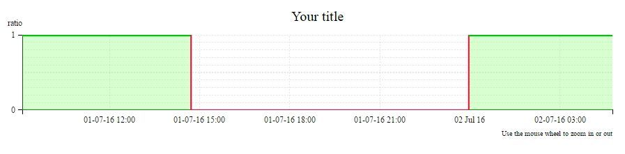
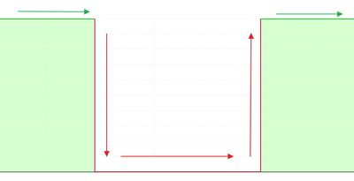

# D3.js Chart: Multi colored area edge

Created with [D3.js](https://github.com/d3/d3)

Initially, it was supposed to be a simple area chart. But lalety I needed to highlight area edges depending on the ratio value.



I used `reduce` function on dataset array to make a new array with coordinates for Lines. As you see, Lines are filled red, when the ratio value falls to zero or equals zero.

```javascript
jsonData.data.reduce(function (prevVal, currVal) {
    var color = (prevVal.val == "0" || currVal.val == "0") ? "#ff003a" : "#02c211";
    lineArray.push({
        p: [{ x: prevVal.date, y: prevVal.val }, { x: currVal.date, y: currVal.val }],
        c: color
    })
    return currVal;
});
```



Feel free to edit / manipulate in any way you wish.

## Demo

Here is a live demo of [D3.js Multi colored area edge](https://rufflet.github.io/d3-multiColoredAreaEdges/)

## Sources

This project makes use of several other projects:

 - [jQuery](https://github.com/jquery/jquery)
 - [D3.js](https://github.com/d3/d3)
